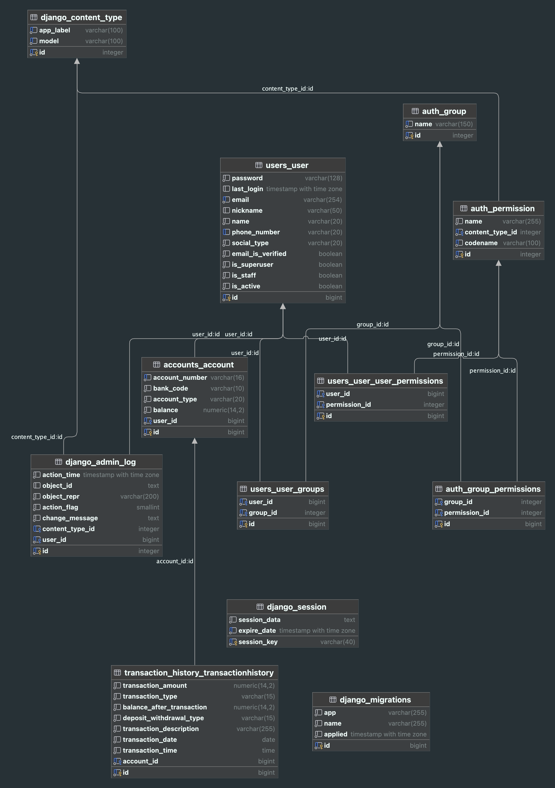
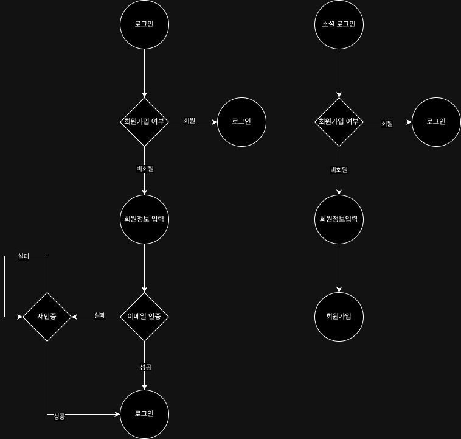

# OZ-MINI-PROJECT-TEAM-5

## 프로젝트 소개

## 참여 인원
<table>
  <tbody>
    <tr>
      <td align="center"><a href="https://github.com/hwangtate" style="text-decoration: none"> <b>팀장 : 황태영</b></a> </td>
      <td align="center"><a href="https://github.com/SongMihyun" style="text-decoration: none"> <b>팀원 : 송미현</b></a> </td>
      <td align="center"><a href="https://github.com/hongdyuk" style="text-decoration: none"> <b>팀원 : 이동혁</b></a> </td>
    </tr>
  </tbody>
</table>

## 사용 스택

    
    
    
    
    

 

## ERD

## User Flow Chart

## API 명세서

## 프로젝트 구조
